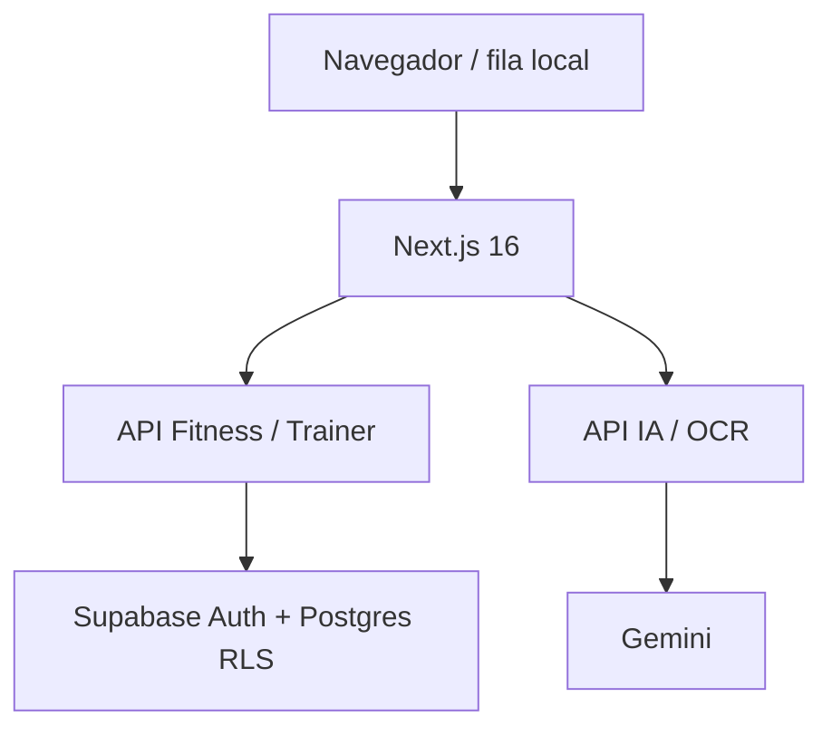

# Arquitetura

Estado do código em 2026-09-24. Consulte [contexto](PROJECT_CONTEXT.md) e [banco](DATABASE.md).

## Auth

`features/fitness/access-gate.tsx` faz cadastro/login/recovery via Supabase Auth. `app/auth/callback/route.ts` troca código por sessão e só aceita retorno local; `app/reset-password/page.tsx` define senha após recuperação. `features/fitness/profile.tsx` altera senha via Auth, incluindo código de reautenticação quando solicitado. O trigger de criação de usuário define `account_profiles.account_type` uma vez; convite com `invited_student` define individual. No cadastro público o tipo personal é escolhível por **conta nova**; não existe promoção após cadastro.

## Persistência individual

`features/fitness/use-fitness.ts` adapta `sync-client.ts` ao React e usa `sync-cache.ts` para snapshot + diário local por aba protegido por Web Locks. `sync.ts` compara versões e conteúdo. `app/api/fitness/route.ts` consulta `lib/fitness/persistence.ts` e usa CAS no Supabase. `lib/fitness/model.ts` valida payload JSONB. 409 é conflito real quando versão/conteúdo divergirem; falha HTTP após commit é reconciliada consultando o servidor antes de reenviar. Tombstones com versão crescente preservam exclusões; sessões não são deletadas ao excluir uma rotina. Cache de conteúdo público do Service Worker não guarda HTML autenticado.

## Geração e OCR

`app/api/ai/workout/route.ts` autentica e limita requests, consulta perfil e até 12 sessões, cria prompt com catálogo, chama `lib/fitness/gemini.ts` e valida resposta com Zod + regras de domínio. `lib/fitness/ai-quota.ts` reserva e confirma quota em funções transacionais; a UI recebe rascunho para revisar. `app/api/ai/ocr/route.ts` transcreve imagem em memória; `lib/fitness/import.ts` interpreta texto para revisão antes de salvar. Treino não é gravado pela IA.

## Trainer/aluno

`app/trainer/page.tsx` e `features/fitness/trainer-portal.tsx` usam `app/api/trainer/*`. O personal cria ficha em `features/fitness/student-invite-form.tsx`; o servidor usa Auth Admin para convite e cria `trainer_invites`. `accept_trainer_invite` confere e-mail Auth e vincula/alimenta perfil em uma transação. `trainer_students` define vínculo ativo. Prescrições em `trainer_routines` são editáveis somente pelo personal vinculado; execução do aluno vira sessão na conta dele em `fitness_resources`. Histórico individual antigo permanece. Os handlers validam acesso; RLS aplica isolamento no banco.

## Feedback e notificações

Aluno envia relato por `app/api/trainer/feedback/route.ts`; personal responde e resolve. Triggers SQL notificam feedback, resposta, alteração de prescrição e vínculo; `app/api/notifications/route.ts` lista e marca leitura. Lembretes de pagamento são gerados quando a lista é consultada via função SQL, com índice de deduplicação. Interface: `features/fitness/notification-bell.tsx`.

## Exportação e progresso

`lib/fitness/pdf.ts` converte dados em view model e gera PDF A4 com jsPDF no navegador. `lib/fitness/domain.ts` produz dica determinística de série; `lib/fitness/adherence.ts` calcula aderência e sequência em UTC. `lib/fitness/recommendations.ts` filtra alternativas equivalentes; personal pode limitar ou bloquear substituições.
